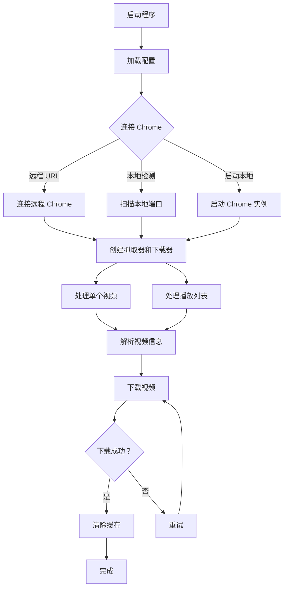

# Hanime Downloader

> ⚠️ **提示**：本项目由 AI 完全编写，**未经任何人工校对**。代码、文档及功能可能存在错误、缺陷或不完善之处，使用时请自行评估风险并谨慎测试。

Hanime 视频下载工具，使用 Chrome DevTools Protocol 进行网页抓取和下载。

## 🌐 语言选择

- 🇨🇳 [简体中文](#--简体中文)
- 🇬🇧 [English](#-english)

---

## 📦 最新版本：v0.4.6 (2026-07-19)

### 新增特性
- ✨ **Web 管理界面** - 提供可视化的视频下载管理界面
- 🎨 **现代化 UI** - 基于 HTML/CSS/JavaScript 的响应式设计
- 📊 **实时进度显示** - 可视化显示下载进度和状态
- 🔄 **批量操作** - 支持通过 Web 界面批量管理下载任务

### 更新内容
- 重构项目结构，采用模块化设计
- 新增 `web/` 模块提供 Web 服务器功能
- 新增 `chrome/` 模块独立 Chrome 浏览器管理
- 新增 `scraper/` 模块独立网页抓取逻辑
- 新增 `downloader/` 模块独立文件下载逻辑
- 新增 `config/` 模块独立配置管理

### v0.4.6 修复 (2026-07-19)
- 🐛 **目录自动创建** - 修复下载时目标父目录（如 `download/<影片名>/`）不存在导致临时文件创建失败的问题，现会在写入前自动 `MkdirAll` 父目录
- 🐛 **新标签页代替新窗口** - 修复 chromedp 在远程浏览器下每次抓取都会打开「新窗口」的问题，改为在已有浏览器中打开「新标签页」（新增 `chrome.CreateTab()`，`scraper` 通过 `WithTargetID` 附着，任务结束自动关闭标签页）

## 功能特性

- 🎬 支持单个视频下载
- 📋 支持播放列表批量下载
- 🔄 支持断点续传
- 📦 支持下载进度缓存
- 🌐 支持代理配置
- 🎨 支持多分辨率选择
- ⚡ 支持多线程并发下载

## 项目结构

```
hanime-dl/
├── main.go              # 主程序入口
├── config/
│   └── config.go        # 配置管理模块
├── chrome/
│   └── chrome.go        # Chrome 浏览器管理模块
├── scraper/
│   └── scraper.go       # 网页抓取模块
├── downloader/
│   └── downloader.go    # 文件下载模块
├── web/
│   └── web_server.go    # Web 服务器模块
├── config.yaml          # 配置文件
├── go.mod               # Go 模块定义
└── README.md            # 项目说明
```

### 模块说明

| 模块 | 功能 | 主要函数 |
|------|------|----------|
| `config` | 配置管理 | `Load()`, `MustLoad()` |
| `chrome` | Chrome 浏览器管理 | `GetWebSocketDebuggerURL()`, `AutoDetectChrome()`, `StartLocalChrome()`, `CreateTab()` |
| `scraper` | 网页抓取 | `GetPlaylist()`, `ResolveVideoInfo()`, `RefreshVideoDataURL()` |
| `downloader` | 文件下载 | `DownloadFile()`, `DownloadWithRetry()` |
| `web` | Web 服务器 | `RunWebServer()`, `NewWebServer()` |

## 安装

### 前置要求

- Go 1.19+
- Google Chrome 或 Chromium 浏览器

### 编译

```bash
# 克隆项目
git clone <repository-url>
cd hanime-dl

# 下载依赖
go mod download

# 编译
go build -o hanime-dl .
```

## 配置

编辑 `config.yaml` 文件：

```yaml
# Chrome 远程调试 URL
chromeRemoteURL: http://localhost:9222/json/version

# 缓存目录
CacheDir: ./cache

# 下载目录
DownDir: ./downloads

# HTTP 代理（可选）
HttpProxy: http://proxy.example.com:8080

# 是否优先尝试直接下载
DirectDownloadFirst: true

# 最大并发下载线程数
MaxDownloadWorkers: 3

# 播放列表 ID 列表
ListCode:
  - "playlist-id-1"
  - "playlist-id-2"

# 单个视频 ID 列表
SingleCode:
  - "video-id-1"

# 下载后清除缓存
ClearCache: true

# 视频分辨率（如：1080p, 720p）
VideoResolution: 1080p
```

### 配置项说明

| 配置项 | 类型 | 说明 |
|--------|------|------|
| `chromeRemoteURL` | string | Chrome DevTools WebSocket URL |
| `CacheDir` | string | 缓存目录路径 |
| `DownDir` | string | 视频下载目录路径 |
| `HttpProxy` | string | HTTP 代理地址（可选） |
| `DirectDownloadFirst` | bool | 是否优先尝试直接下载 |
| `MaxDownloadWorkers` | int | 并发下载线程数 |
| `ListCode` | []string | 播放列表 ID 列表 |
| `SingleCode` | []string | 单个视频 ID 列表 |
| `ClearCache` | bool | 下载后是否清除缓存 |
| `VideoResolution` | string | 目标视频分辨率 |

## 使用方法

### 运行程序

```bash
# 使用默认配置
./hanime-dl

# 指定配置文件
./hanime-dl -config /path/to/config.yaml

# 查看帮助
./hanime-dl -h
```

### 命令行参数

| 参数 | 默认值 | 说明 |
|------|--------|------|
| `-config` | `config.yaml` | 配置文件路径 |
| `-web` | `false` | 启动 Web 服务器模式 |
| `-web-addr` | `:8080` | Web 服务器地址 |

### Web 界面使用 （推荐）

启动 Web 服务器模式：
直接如无配置CDP 或 连接失败 ,默认会启动本地 Chrome 实例,并连接到该实例

```bash
# 使用默认配置启动 Web 服务器
./hanime-dl -web

# 指定端口
./hanime-dl -web -web-addr :3000

# 访问 Web 界面
# 打开浏览器访问 http://localhost:8080
```

Web 界面功能：
- 📱 响应式设计，支持移动端访问
- 📋 查看下载队列和进度
- ⚙️ 配置下载参数
- 🎬 管理视频下载任务
- 📊 实时显示下载状态


### Chrome 浏览器设置

#### 方式 1：手动启动 Chrome（推荐）

```bash
# Linux
google-chrome --remote-debugging-port=9222

# macOS
"/Applications/Google Chrome.app/Contents/MacOS/Google Chrome" --remote-debugging-port=9222

# Windows
"C:\Program Files\Google\Chrome\Application\chrome.exe" --remote-debugging-port=9222
```

#### 方式 2：使用 Docker 桌面环境

```bash
cd ubuntu-desktop
docker compose up -d
```

#### 方式 3：配置远程 Chrome

在 `config.yaml` 中设置远程 Chrome 地址：

```yaml
chromeRemoteURL: http://your-chrome-host:9222/json/version
```


## 工作流程



## 缓存机制

程序使用缓存来提高效率和支持断点续传：

- **播放列表缓存**: `cache/list_<video-id>.json`
- **视频信息缓存**: `cache/info_<video-id>.json`

缓存文件包含：
- 播放列表：视频 ID 列表
- 视频信息：标题、封面图 URL、下载 URL、文件路径等

设置 `ClearCache: true` 可在下载完成后自动清除缓存。

## 错误处理

程序包含完善的错误处理机制：

- **自动重试**: 下载失败时自动重试最多 5 次
- **断点续传**: 支持从上次中断的位置继续下载
- **代理支持**: 支持 HTTP 代理，适用于网络受限环境
- **分辨率降级**: 请求的分辨率不可用时自动降级到可用分辨率

## 常见问题

### Q: 无法连接到 Chrome

**A**: 确保 Chrome 已启动并启用远程调试：
```bash
google-chrome --remote-debugging-port=9222
```

### Q: 下载速度慢

**A**: 
1. 检查代理配置是否正确
2. 增加 `MaxDownloadWorkers` 值
3. 尝试 `DirectDownloadFirst: false`

### Q: 视频分辨率不符合要求

**A**: 设置 `VideoResolution` 为所需分辨率，如 `1080p`、`720p` 等。

### Q: 如何继续中断的下载

**A**: 程序会自动检测缓存并继续未完成的下载。只需重新运行程序即可。

## 开发指南

### 添加新功能

1. 在对应模块中实现功能
2. 在 `main.go` 中调用新函数
3. 更新 `README.md` 文档

### 代码规范

- 使用 Go 标准格式化：`go fmt ./...`
- 运行静态检查：`go vet ./...`
- 添加单元测试（未来计划）

## 许可证

MIT License

## 贡献

欢迎提交 Issue 和 Pull Request！

## 致谢

- [chromedp](https://github.com/chromedp/chromedp) - Chrome DevTools Protocol 库
- [gopkg.in/yaml.v3](https://gopkg.in/yaml.v3) - YAML 解析库

---

## 🇬🇧 English

### Latest Version: v0.4.6 (2026-07-19)

#### What's New
- ✨ **Web Management Interface** - Visual video download management
- 🎨 **Modular Refactoring** - Clean project structure (chrome/, config/, scraper/, downloader/, web/)
- 📊 **Real-time Progress** - Visual download status
- 🔄 **Batch Operations** - Manage download tasks via Web interface

#### Features
- 🎬 Single video download support
- 📋 Playlist batch download support
- 🔄 Resume interrupted downloads
- 📦 Download progress caching
- 🌐 Proxy configuration support
- 🎨 Multiple resolution options
- ⚡ Multi-threaded concurrent downloads

#### Quick Start

**Prerequisites**
- Go 1.19+
- Google Chrome or Chromium browser

**Build**
```bash
# Clone the repository
git clone <repository-url>
cd hanime-dl

# Download dependencies
go mod download

# Build
go build -o hanime-dl .
```

**Configuration**
Edit `config.yaml`:
```yaml
chromeRemoteURL: http://localhost:9222/json/version
CacheDir: ./cache
DownDir: ./downloads
HttpProxy: http://proxy.example.com:8080
DirectDownloadFirst: true
MaxDownloadWorkers: 3
VideoResolution: 1080p
```

**Chrome Setup**
```bash
# Linux
google-chrome --remote-debugging-port=9222

# macOS
"/Applications/Google Chrome.app/Contents/MacOS/Google Chrome" --remote-debugging-port=9222

# Windows
"C:\Program Files\Google\Chrome\Application\chrome.exe" --remote-debugging-port=9222
```

**Run**
```bash
# Default configuration
./hanime-dl

# Web server mode
./hanime-dl -web -web-addr :8080

# View help
./hanime-dl -h
```

**Web Interface**
Access `http://localhost:8080` for:
- 📱 Responsive design (mobile-friendly)
- 📋 View download queue and progress
- ⚙️ Configure download parameters
- 🎬 Manage video download tasks
- 📊 Real-time download status

#### Releases
- **v0.4.6**: Bug fixes - auto-create download dirs, open new tab instead of new window (`CreateTab`)
- **v0.4.1**: Modular refactoring, Web interface added
- **v0.4.0**: Initial modular architecture
- **v0.3.1**: Bug fixes and improvements

Download binaries from [GitHub Releases](https://github.com/mingjiezxc/hanime-dl/releases)

#### License
MIT License

#### Contributing
Issues and Pull Requests are welcome!

#### Acknowledgments
- [chromedp](https://github.com/chromedp/chromedp) - Chrome DevTools Protocol library
- [gopkg.in/yaml.v3](https://gopkg.in/yaml.v3) - YAML parsing library
